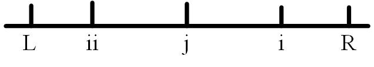
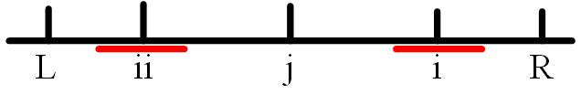
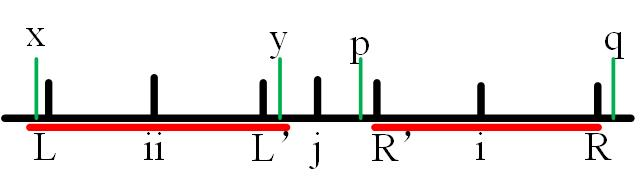
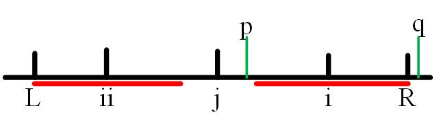

## 题目描述
给你一个字符串`s`，找到`s`中最长的回文子串。

**示例1：**
```
输入：s = "babad"
输出："bab"
解释："aba" 同样是符合题意的答案。
```

## 题解思路
和其他题目一样，暴力枚举会超出时间限制。首先想到的便是动态规划，用$P(i,j)$来表示字符串中第$i$个到$j$个字符是不是回文串。当$P(i+1,j-1)$为true，且$s[i]==s[j]$时，$P(i,j)$才会是true。代码如下，也可见[solve.py](solve.py)。

```python
class Solution:
    def longestPalindrome1(self, s: str) -> str:
        n = len(s)
        if n < 2: return s
        dp = [[False] * n for _ in range(n)]
        for i in range(n):
            dp[i][i] = True
        max_len, begin = 1, 0
        for l in range(2, n + 1):
            for i in range(n): # 此处枚举i和长度，更加方便，j通过l+i-1求得
                j = l + i - 1
                if j >= n: break
                if s[i] != s[j]:
                    dp[i][j] = False
                else:
                    if j - i < 3:
                        dp[i][j] = True
                    else:
                        dp[i][j] = dp[i + 1][j - 1]
                if dp[i][j] and l > max_len:
                    max_len = l
                    begin = i
        return s[begin:begin + max_len]
```

## 优化思路
上述动态规划的时间复杂度为$O(n^2)$。此处介绍一个复杂度为$O(n)$的Manacher算法。
首先，我们定义：

- 右边界R：它是所有已知右边界中最靠右的位置，也就是说r只增不减。
- 回文中心j：以r为右边界的回文串的中心位置
- arm_len数组：存储每个点最大的回文半径

在开始之前，我们现将字符串每一个字符中间加入‘#’，将长度n便为2n+1，将奇数偶数情况统一。然后便开始从下标i=0开始遍历，下面依旧是分情况讨论：
- $i>R$：此时没什么花里胡哨的方法，直接以$s[i]$为中心，开始匹配，然后更新j和R；
- $i<=R$：对于这种情况，我们首先画一张图。
  
  其中，L和ii分别的R和i关于中心j的对称点，此时ii和j处的最大回文半径是已知的。我们继续分情况：
  - ii的回文区域，在L-R的内部，如下图，此时i的最大回文半径可以直接等于arm_len[ii]；
  
  - ii的回文区域的左边界超过了L，此时i的回文半径应该是i-R，如下图：
  
  图中L'和R'分别是L关于ii的对称点和R关于i的对称点，xypq分别是边界旁边的一个数字。由于LL'和RR'以及LR都是回文串，我们可以得到$x=y$，$y=p$，$x!=q$，所以我们得到$p!=q$，所i的回文半径只能是i-R
  - ii的回文半径刚好和边界重合，此时i的回文半径至少为i-R，还需继续向外进行匹配计算，判断pq是否相等，如下图：
  

最终代码如下，也可见[solve.py](solve.py)。

```python
class Solution:
    def longestPalindrome2(self, s: str) -> str:
        end, start, r, j = -1, 0, -1, -1
        s = '#' + '#'.join(list(s)) + '#'
        arm_len = [0] * len(s)
        print(s)
        for i in range(len(s)):
            # arm_len[i] = 1 if i >= r else min(arm_len[2 * j - i], r - i)
            # while i - arm_len[i] >= 0 and i + arm_len[i] <= len(s) - 1 and s[i - arm_len[i]] == s[i + arm_len[i]]:
            #     arm_len[i] += 1

            # 下面是上述的几种情况。对于“ii的左边界超过了L，i的回文区域肯定为i-R”这种情况，假如继续扩展，那下一次的判断肯定是不通过的，多判断一次并不会耗费太多时间，所以上面的代码便是合并几个条件后的，下面的每一种情况分开的
            if i >= r:
                arm_len[i] = 1
                while i - arm_len[i] >= 0 and i + arm_len[i] <= len(s) - 1 and s[i - arm_len[i]] == s[i + arm_len[i]]:
                    arm_len[i] += 1
            else:
                if arm_len[j * 2 - i] > r - i:
                    arm_len[i] = r - i 
                elif arm_len[j * 2 - i] < r - i:
                    arm_len[i] = arm_len[j * 2 - i]
                else:
                    arm_len[i] = r - i 
                    while i - arm_len[i] >= 0 and i + arm_len[i] <= len(s) - 1 and s[i - arm_len[i]] == s[i + arm_len[i]]:
                        arm_len[i] += 1


            if i + arm_len[i] > r: # 若i超过了R，便更新j和R
                r = i + arm_len[i] 
                j = i
            if arm_len[i] * 2 > end - start: # 记录当前最大
                start, end = i - arm_len[i], i + arm_len[i]
        return s[start+2:end-1:2]
```